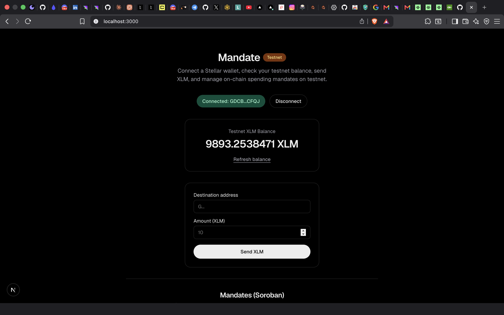
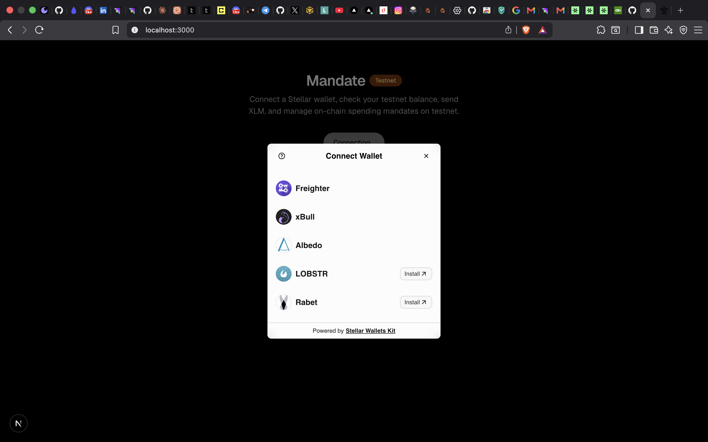
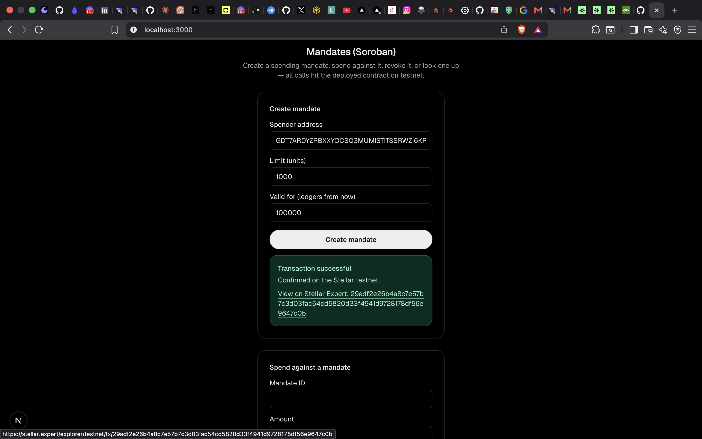
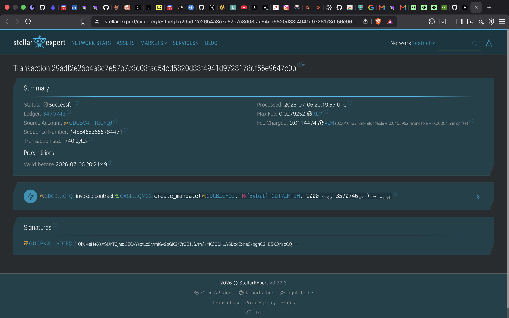

# Mandate

[](https://github.com/DeborahOlaboye/mandate/actions/workflows/ci.yml)

**Live demo:** https://mandate-one.vercel.app/

Mandate is a policy-bound payment platform for the Stellar network. The core
idea: a spending **mandate** is a scoped, revocable authorization — instead
of handing an agent, app, or automation your full wallet keys, you grant it
a mandate that only lets it spend within rules you define (an amount limit,
a destination allowlist, a time window, etc.), enforced on-chain rather than
by convention or client-side trust.

This matters most for autonomous/agentic use cases: an AI agent that pays
for API calls, subscriptions, or services on your behalf should never hold
unrestricted signing power over your account. Mandate's goal is to make
"grant a scoped, enforceable spending policy" as easy as a normal payment.

## Architecture

The repository has two parts:

- **`frontend/`** — a Next.js (App Router) app that connects a Stellar
  wallet, reads an account's XLM balance, sends payments, and provides a UI
  for approving a token allowance, creating mandates, spending against them,
  revoking them, and looking them up.
- **`contracts/mandate/`** — a Soroban smart contract that stores mandates
  (owner, spender, asset, limit, spent-so-far, expiration ledger, revoked
  flag), enforces the spending policy, and — on every `spend` — calls into
  the underlying SEP-41 token contract to actually move funds.

```
Browser (wallet-signed tx)
   │
   ▼
Mandate contract  ──inter-contract call──▶  Token contract (native XLM SAC)
   │  enforces: revoked? expired?              transfer_from(owner → destination)
   │  limit exceeded? allowance sufficient?
   ▼
Emits event (mandate_created / mandate_spent / mandate_revoked)
   │
   ▼
Frontend event feed (polls Soroban RPC, updates live)
```

### Deployed contract (Stellar testnet)

- Contract ID: `CA3F6CZXUW3RUOIYJ6HSEK6SG6B2XOYOWOYSRNLRL4JQP646SEEOYKD4`
- Native XLM token contract (SAC) it calls into: `CDLZFC3SYJYDZT7K67VZ75HPJVIEUVNIXF47ZG2FB2RMQQVU2HHGCYSC`

**End-to-end example (owner approves → creates a mandate → spender spends, moving real testnet XLM):**

| Step | Call | Transaction |
|---|---|---|
| 1 | Owner approves the Mandate contract as a token spender | [`b351efd33665e968bdf5bae91121d070a201bda70fa490babec17dbd1632a912`](https://stellar.expert/explorer/testnet/tx/b351efd33665e968bdf5bae91121d070a201bda70fa490babec17dbd1632a912) |
| 2 | Owner creates a mandate | [`567d0dd5e8e8a68ec3c78c93b9239005f22f92841168483a4a6c86c0e35bce96`](https://stellar.expert/explorer/testnet/tx/567d0dd5e8e8a68ec3c78c93b9239005f22f92841168483a4a6c86c0e35bce96) |
| 3 | Spender spends against it — this single transaction emits **both** a token `transfer` event and a `mandate_spent` event, proving the inter-contract call | [`3ee6772b84e6254a2872cd6902832fd608ba999d084c8681557f56680c210408`](https://stellar.expert/explorer/testnet/tx/3ee6772b84e6254a2872cd6902832fd608ba999d084c8681557f56680c210408) |

## Implemented

**Wallet & payments**
- Connect/disconnect via [StellarWalletsKit](https://github.com/Creit-Tech/Stellar-Wallets-Kit), supporting Freighter, xBull, Albedo, LOBSTR, and Rabet
- Fetch and display the connected account's XLM balance, with a Friendbot funding shortcut for unfunded testnet accounts
- Send an XLM payment to any address, with client-side address validation

**Mandate contract**
- `create_mandate(owner, spender, asset, limit, expiration_ledger)` — owner-authorized, write
- `spend(mandate_id, amount, destination)` — spender-authorized; checks revocation, expiry, and remaining limit, then calls the token contract's `transfer_from` to move the funds (real inter-contract communication)
- `revoke(mandate_id)` — owner-authorized, write
- `get_mandate(mandate_id)` — read
- Each action emits a contract event (`mandate_created`, `mandate_spent`, `mandate_revoked`)

**Frontend integration**
- Contract calls made directly from the browser using `@stellar/stellar-sdk`'s generic `contract.Client` (built from the on-chain contract spec, no separate codegen step)
- A live event feed polls Soroban RPC for the contract's events and updates in real time, with a visible "reconnecting" state if a poll fails instead of failing silently
- Every write call surfaces a visible pending → success/fail status with the transaction hash
- Error handling covers: no wallet detected, transaction rejected in the wallet, and contract-level errors (mandate limit exceeded, insufficient token allowance, expired, revoked)
- Network config (contract IDs, RPC URLs) is overridable via environment variables — see `frontend/.env.example`

### Planned

- Destination allowlists per mandate, not just an amount limit
- A dashboard listing all mandates for a connected account
- Support for assets other than native XLM (the contract already takes an `asset` parameter; the frontend currently only exposes native XLM in its forms)

## Tech stack

- Next.js (App Router) + TypeScript + Tailwind CSS — `frontend/`
- [`@stellar/stellar-sdk`](https://www.npmjs.com/package/@stellar/stellar-sdk) for Horizon/Soroban RPC calls, transaction building, and the contract client
- [`@creit.tech/stellar-wallets-kit`](https://www.npmjs.com/package/@creit.tech/stellar-wallets-kit) for multi-wallet connection and signing
- [Vitest](https://vitest.dev/) for frontend unit tests
- Soroban (Rust) — `contracts/mandate/`
- GitHub Actions for CI (contract tests + build, frontend lint/test/build) — `.github/workflows/ci.yml`

## Prerequisites

- Node.js 18+
- Rust with the `wasm32v1-none` target, and the [`stellar` CLI](https://developers.stellar.org/docs/tools/cli/install-cli) (only needed to rebuild/redeploy the contract)
- A Stellar wallet browser extension (Freighter, xBull, LOBSTR, or Rabet) or Albedo, set to **Test Net**
- A funded testnet account (the app can fund it for you via Friendbot if it's empty)

## Setup

```bash
cd frontend
npm install
cp .env.example .env.local   # optional — defaults already point at testnet
npm run dev
```

Open [http://localhost:3000](http://localhost:3000) in a browser with a
Stellar wallet available.

## Usage

1. Click **Connect Wallet** and pick a wallet from the list.
2. Your XLM balance loads automatically. If the account doesn't exist yet on testnet, click **Fund with Friendbot**.
3. Send a plain XLM payment, or scroll to **Mandates (Soroban)**:
   1. **Approve** the Mandate contract to spend up to a limit of your XLM (a one-time SEP-41 `approve` call).
   2. **Create a mandate** naming a spender and a limit at or below what you approved.
   3. **Spend** against the mandate as the spender — this moves real testnet XLM from the owner to the destination.
   4. **Revoke** or **look up** a mandate at any time.
   - Every action shows a pending → success/fail status with a transaction hash, and confirmed events appear in the live feed below.

## Testing

**Contract tests** (7 tests — mandate lifecycle, limit/expiry/revocation checks, and a real token transfer via a test token):

```bash
cd contracts
cargo test
```

**Frontend tests** (8 tests — address validation, and the contract write-runner's error normalization for rejections and contract-level errors):

```bash
cd frontend
npm test
```

Both suites run in CI on every push — see the badge at the top of this file, or `.github/workflows/ci.yml`.

## Rebuilding/redeploying the contract

```bash
cd contracts
cargo test
stellar contract build
stellar contract deploy \
  --wasm target/wasm32v1-none/release/mandate.wasm \
  --source <your-identity> \
  --network testnet \
  --alias mandate
```

If you redeploy, update `NEXT_PUBLIC_MANDATE_CONTRACT_ID` (or the default in `frontend/lib/mandateContract.ts`).

## Screenshots

**Wallet connected + balance displayed**


**Wallet options available**


**Successful contract transaction, result shown to the user**


**Transaction verified on Stellar Expert**


**Mobile responsive UI**


**CI pipeline passing**


**Test output (3+ passing tests)**


## Demo video

<!-- Add a 1-2 minute walkthrough link here: connect wallet, send a payment, approve + create + spend a mandate. -->

## Repository structure

```
.github/workflows/ci.yml              # CI: contract tests/build, frontend lint/test/build

contracts/mandate/src/lib.rs          # Mandate contract: create/spend/revoke/get_mandate + events + token transfer
contracts/mandate/src/test.rs         # Contract unit tests (incl. a real token transfer via a test token)

frontend/.env.example                 # Overridable network/contract config
frontend/app/page.tsx                 # Main page: wallet, balance, payment, and mandate UI
frontend/lib/stellar.ts               # Horizon client, balance fetch, payment build/submit, Friendbot
frontend/lib/useWallet.ts             # Wallet connect/disconnect state hook
frontend/lib/walletKit.ts             # StellarWalletsKit setup (multi-wallet) and signing wrapper
frontend/lib/mandateContract.ts       # Mandate contract client, write-call runner, event parsing
frontend/lib/tokenContract.ts         # SEP-41 token client (for the allowance approval step)
frontend/lib/useMandateEvents.ts      # Polls Soroban RPC for live contract events
frontend/lib/validation.ts            # Stellar address format validation
frontend/components/WalletConnect.tsx     # Connect/disconnect UI
frontend/components/BalanceCard.tsx       # Balance display + refresh
frontend/components/SendPaymentForm.tsx   # XLM payment form
frontend/components/MandateSection.tsx    # Approve/create/spend/revoke/lookup mandate UI
frontend/components/EventFeed.tsx         # Live contract event feed
frontend/components/TransactionResult.tsx # Pending/success/fail feedback with tx hash link
```
